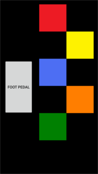
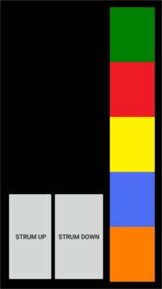

# GHTap
Android app/server combo for mapping virtual instruments to keyboard presses, such as for Guitar Hero / Rock Band / clones.
Server runs on the host computer on the same network as the phone, communicates using socket.io.

## Does it work?
Tested with Guitar Hero running on Dolphin, and I can stumble my way through songs on Medium.
Granted I'm trash at Guitar Hero, but the variable latency of sending packets over wireless through a router makes things unnecessarily tough (rewriting for bluetooth should fix this).
Lack of real tactile feedback doesn't exactly help either.

